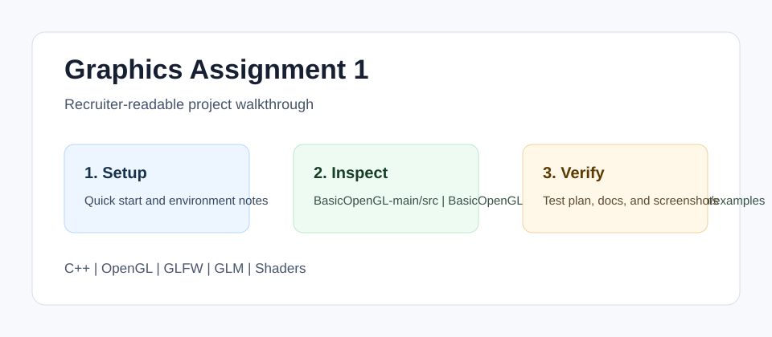

<!-- bettergithub:generated-readme -->
# Graphics Assignment 1

Graphics Assignment 1 is a C++ OpenGL project with reusable rendering wrappers, shader files, texture assets, GLFW and GLM dependencies, and example scenes. It helps reviewers inspect graphics fundamentals such as buffers, vertex arrays, shaders, textures, camera movement, and assignment-specific rendering output from the original course layout.

## Tech Stack

- C++
- OpenGL
- GLFW
- GLM
- Shaders
- GitHub Actions

## Quick Start

```bash
Open BasicOpenGL-main.
Build with the included makefile or the course graphics environment.
Run the assignment executable and compare the rendered scene with the documented walkthrough.
```

## Usage

- Start with BasicOpenGL-main/src.
- Review shader files under src/res/shaders.
- Use docs/test-plan.md to record visual output after rebuilding.

## Environment Variables

No .env file or API key is required. A C++ compiler, OpenGL runtime, and the bundled/course graphics libraries are the expected configuration.

## Demo and Screenshots



The diagram above is a lightweight walkthrough image for GitHub reviewers. It shows the reviewer path, the implementation areas to inspect, and the evidence this repository provides. For non-web course projects, this replaces a live demo with reproducible local setup and manual verification notes.

## Testing and Quality

Testing is documented even when the original assignment uses manual verification instead of a full automated suite.

```bash
Manual test: build the OpenGL project, run the executable, and verify that the documented scene renders without runtime errors.
```

See [docs/test-plan.md](docs/test-plan.md) for the manual or automated checks that should be used before presenting this repository.

## Repository Structure

- `BasicOpenGL-main/src`
- `BasicOpenGL-main/include`
- `BasicOpenGL-main/examples`
- `docs`

## Architecture Notes

The original code remains under BasicOpenGL-main. The added root docs and source map make that nested layout easy for a recruiter or reviewer to inspect.

See [docs/architecture.md](docs/architecture.md) for a more detailed reviewer map.

## Recruiter Notes

- The README opens with the project purpose, audience, and result so the repository is scannable.
- Setup, environment, usage, testing, and architecture notes are collected in predictable sections.
- Existing source code was not changed by the documentation polish pass.

## Roadmap

- Add a short result screenshot or terminal capture after the project is rerun locally.
- Add one small automated smoke test if the course/tooling environment makes it practical.
- Keep the README aligned with the latest verified run command.

